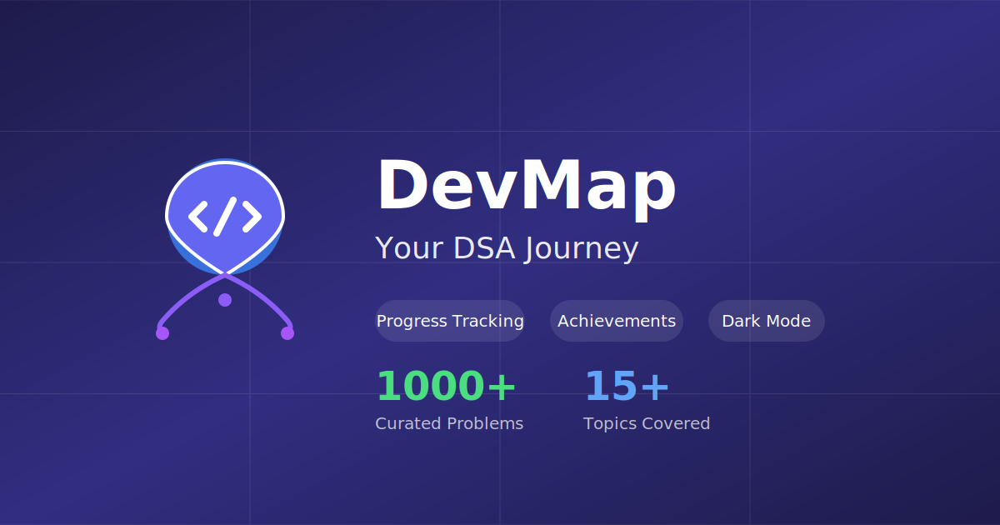

# DevMap - Your DSA Journey

<div align="center">



**Master Data Structures and Algorithms with a comprehensive learning platform**

[](https://nextjs.org/)
[](https://reactjs.org/)
[](https://www.typescriptlang.org/)
[](https://tailwindcss.com/)

[Live Demo](#) • [Features](#features) • [Getting Started](#getting-started) • [Contributing](#contributing)

</div>

---

## 🚀 Features

- ✅ **Progress Tracking** - Track your completion status across 1000+ curated DSA problems
- 🏆 **Achievement System** - Earn XP and unlock achievements as you solve problems
- 🎨 **Multiple Themes** - Terminal, Zen, Quest, Modern, and Retro modes
- 🌙 **Dark Mode** - Full dark mode support with smooth transitions
- ⌨️ **Keyboard Shortcuts** - Navigate efficiently with keyboard controls
- 📝 **Personal Notes** - Add notes to questions for future reference
- 📊 **Statistics Dashboard** - Visualize your learning progress with detailed stats
- 🎯 **Topic-based Learning** - Organized learning paths for all major DSA topics
- 💾 **Local Storage** - All progress saved locally, no account required
- 📱 **PWA Support** - Install as a native app on any device
- 🔍 **SEO Optimized** - Fully optimized for search engines

## 📸 Screenshots

<div align="center">
  
</div>

## 🛠️ Tech Stack

- **Framework**: [Next.js 16](https://nextjs.org/) - React framework with App Router
- **UI Library**: [React 19](https://react.dev/) - Latest React version
- **Language**: [TypeScript](https://www.typescriptlang.org/) - Type-safe JavaScript
- **Styling**: [Tailwind CSS 4](https://tailwindcss.com/) - Utility-first CSS framework
- **State Management**: React Context API
- **Icons**: Heroicons (via inline SVG)
- **Fonts**: Geist Sans & Geist Mono

## 🏁 Getting Started

### Prerequisites

- Node.js 20+ and npm/yarn/pnpm/bun

### Installation

1. Clone the repository:
```bash
git clone https://github.com/yourusername/devmap.git
cd devmap
```

2. Install dependencies:
```bash
npm install
# or
yarn install
# or
pnpm install
# or
bun install
```

3. Run the development server:
```bash
npm run dev
# or
yarn dev
# or
pnpm dev
# or
bun dev
```

4. Open [http://localhost:3000](http://localhost:3000) in your browser.

## 📁 Project Structure

```
devmap/
├── public/              # Static assets
│   ├── favicon.svg      # App favicon
│   ├── og-image.svg     # Social share image
│   ├── manifest.json    # PWA manifest
│   ├── robots.txt       # Search engine directives
│   ├── sitemap.xml      # Site structure
│   └── llms.txt         # LLM context file
├── src/
│   ├── app/             # Next.js App Router
│   │   ├── layout.tsx   # Root layout with metadata
│   │   ├── page.tsx     # Homepage
│   │   ├── globals.css  # Global styles & themes
│   │   └── stats/       # Statistics page
│   ├── components/      # React components
│   │   ├── DSAWebsite.tsx        # Main app component
│   │   ├── ProgressProvider.tsx  # Progress state management
│   │   ├── ThemeSwitcher.tsx     # Theme controls
│   │   ├── TopicMap.tsx          # Topic visualization
│   │   ├── AchievementPopup.tsx  # Achievement notifications
│   │   ├── DevMapLogo.tsx        # App logo component
│   │   └── ...
│   ├── data/            # DSA content data
│   ├── utils/           # Utility functions
│   ├── hooks/           # Custom React hooks
│   └── lib/             # Library code
└── package.json
```

## 🎨 Themes

DevMap comes with 5 beautiful themes:

1. **Fusion** (Default) - Modern gradient theme
2. **Terminal** - Hacker-style green terminal
3. **Zen** - Minimal, distraction-free
4. **Quest** - Gamified purple theme
5. **Retro** - Pixel art CRT effect

## ⌨️ Keyboard Shortcuts

- `?` - Open keyboard shortcuts modal
- `k` - Toggle dark mode
- `t` - Switch theme
- `s` - Open statistics
- `Esc` - Close modals

## 📊 Data Structure

Topics are organized hierarchically:
```typescript
Topic → Categories → Questions
```

Each question includes:
- Title and link
- Difficulty level
- Practice platforms (LeetCode, GFG, etc.)
- Progress status

## 🤝 Contributing

Contributions are welcome! Please feel free to submit a Pull Request.

1. Fork the repository
2. Create your feature branch (`git checkout -b feature/AmazingFeature`)
3. Commit your changes (`git commit -m 'Add some AmazingFeature'`)
4. Push to the branch (`git push origin feature/AmazingFeature`)
5. Open a Pull Request

## 📝 License

This project is open source and available under the [MIT License](LICENSE).

## 🙏 Acknowledgments

- Inspired by popular DSA learning platforms
- Built with amazing open-source technologies
- Community-driven problem curation

## 📧 Contact

For questions or feedback, please open an issue on GitHub.

---

<div align="center">

**Made with ❤️ for developers learning DSA**

⭐ Star this repo if you find it helpful!

</div>
